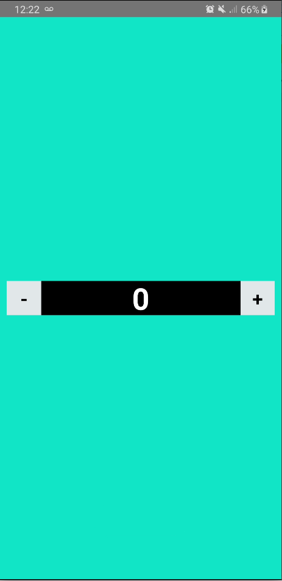

# MOLINA_RN_MD

```
"The biggest mistake we made as a 
company was betting too much on HTML as opposed to native"
2012 Mark Zuckerber
```

# Introduccion a RN 

### Que es RN?
React Native es un framwork de aplicación móvil de código abierto creado por Facebook, Inc. Se utiliza para desarrollar aplicaciones para Android, Android TV, iOS, macOS, tvOS, Web, Windows y UWP al permitir a los desarrolladores usar React junto con las capacidades de la plataforma nativa.

>### Caracteristicas de RN

>#### 1. Escrito en JSX
>
>
>
>JSX es una extensión de JavaScript creada por Facebook para el uso con su librería React. Sirve de preprocesador y transforma el código a JavaScript.

>#### 2. Fast Refresh
>
>
>
>React Fast Refresh es un reemplazo de React Hot Loader. La actualización rápida hace que su aplicación React se vuelva a cargar de manera fluida y sin dolor en los cambios de código, lo que brinda una excelente experiencia para el desarrollador.

>#### 3. Componentes
>
>
>
>Los componentes permiten separar la interfaz de usuario en piezas independientes, reutilizables y pensar en cada pieza de forma aislada.

>#### 4. Estados
>
>
>
>Los componentes de React tienen un objeto de estado incorporado. El objeto de estado es donde almacena los valores de propiedad que pertenecen al componente. Cuando el objeto de estado cambia, el componente vuelve a renderizarse.

>#### 5. Comunidad
>React Native cuenta con una comunidad activa que desarrolla plugins para acceder a ciertas funcionalidades nativas y librerías de componentes.

# Primera app - Contador

- Para comenzar crearemos la aplicacion corriendo el comando en la ubicacion en la que deseemos trabajar

```
npm init react-app Contador
cd Contador
```
- Ejecute la nueva aplicación React para asegurarse de que se generó correctamente
```
npx react-native start
```
- Para correr nuestra aplicacion en el dispositivo que tengamos conectado (virtual o fisico).
    Esto nos instalara nuestra aplicacion en el dispositivo y automaticamente la correra

```
npx react-native run-android
npx react-native run-ios
```
## Empezando a organizar

- Para comenzar crearemos una carpeta llamada component para poder crear nuestros componentes js dentro
```
mkdir components
```
- Y dentro crearemos los dos componentes que necesitaremos mas adelante
```
cd components
touch customButton.js
touch viewer.js
```

## Modificamos nuestra app

- A partir de ahora empezaremos a modificar el codigo de nuestra aplicacion por ende es recomendable utilizar un editor de texto como Atom o Visual Studio Code

### App.js
- En este archivo modificaremos la pagina principal de nuestra app, por lo que primero tenemos que borrar todo lo creado automaticamente por react y luego continuamos
- Agregamos los imports necesarios
```
import React, {useState, Component} from 'react';
import {View, Text, StyleSheet,} from 'react-native';
import CustomButton from './component/customButton.js';
import Viewer from './component/viewer.js';
```
- Y luego drentro de nuestra funcion principal App
```
function App(props) {

    }
```
- Debemos crear un estado de esta que sera el contador
  De esta forma tendremos la funcion count para llamarlo y set count para modificar el valor
```
const [count, setCount] = useState(0);
```
- Y agregamos las dos funciones necesarias para aumentar o disminuir en uno el contador
```
function resta(){
      setCount(count + 1)
    }
function suma(){
      setCount(count + 1)
    }
```
- Y luego crearemos el return que escribiremos con jsx nuestra aplicacion en codigo html
- Esta posee dentro del contenedor (< view>)
- Dos botones 'CustomButton' los cuales ya escribiremos el codigo proximamente
  A cada boton le pasaremos como prop, el label (uno + y otro -) y a cada uno le pasaremos su action donde dentro tendra su funcion 
- Y entre medio de los dos botones llamamos al visor 
``` 
    return (
       <View style={styles.container}>
         <View style={styles.subcontainer}>
          <CustomButton label='-' action={resta}/>
          <Viewer></Viewer>
          <CustomButton label='+' action={suma}/>
         </View>
       </View>  
      );
```
- Les comparto unos estilos para que quede mas lindo
```
const styles = StyleSheet.create({
   container:{
     flex: 1,
     backgroundColor: '#00cec9',
     justifyContent: 'center',
   },
   subcontainer:{
     height: 50,
     width: '100%',
     paddingHorizontal: 10,
     flexDirection: 'row',
   },
   counterContainer:{
     flex: 1,
     backgroundColor: 'black',
     justifyContent: 'center',
     alignItems: 'center',
   },
   counter:{
    fontSize: 40,
    color: 'white',
    fontWeight: 'bold',
   },
 });
```
- Y finalente exportamos la app
```
export default App;
```
### viewer.js
- Ahora tenemos que escribir nuestro visor
Para el cual pasamos sus imports
```
import React from 'react';
import {View, Text, StyleSheet, ViewComponent, TouchableOpacity} from 'react-native';
import PropTypes from 'prop-types';
```
- Luego al igual que en nuestra app, crearemos una funcion para que nos devuelva el visor
- Dentro de esta retornaremos el codigo html que tiene un contenedor y dentro de este un tag de text que tendra al count dentro 
- Y lo exportamos
```
function Viewer(props) {
    return (
        <View style={styles.counterContainer}>
            <Text style={styles.counter}>{count}</Text>
        </View>
    )
};
export default Viewer;
```

### customButtom.js
- Finalmente escribiremos los botones los cuales modificaran el estado de nuestra app y con esto controlaremos el contador
-Primero pegaremos los imports
```
import React from 'react';
import {View, Text, StyleSheet, ViewComponent, TouchableOpacity} from 'react-native';
import PropTypes from 'prop-types';
```
- Luego al igual que antes creamos nuestra funcion que nos devolvera el boton
- Dentro de este extraeremos los props para tener los nombre mas faciles
- Y escribimos el codigo del boton donde en onPress pondremos la action y el texto sera el lebel que le pasemos por los props desde la app principal
```
function CustomButton(props) {
    const { label, action } = props;
    return (
        <TouchableOpacity style={style.btn} onPress={action}> 
          <Text style={style.btnText}>{label}</Text>
        </TouchableOpacity>
    );
};
```
- Finalmente comparto unos estilos para que quede mas lindo
```
const style = StyleSheet.create({
    btn:{
      height: 50,
      width: 50,
      justifyContent: 'center',
      alignItems: 'center',
      backgroundColor: '#dfe6e9'
    },
    btnText:{
      fontSize: 25,
      color: 'black',
      fontWeight: 'bold',
    }
  });
```
- Y lo exportamos
```
export default CustomButton;
```

## Producto Final



#Muchas Gracias
[MOLINA FRANCO](https://github.com/MolinaFranco)

[CONTADOR](https://github.com/MolinaFranco/Counter_Molina)


